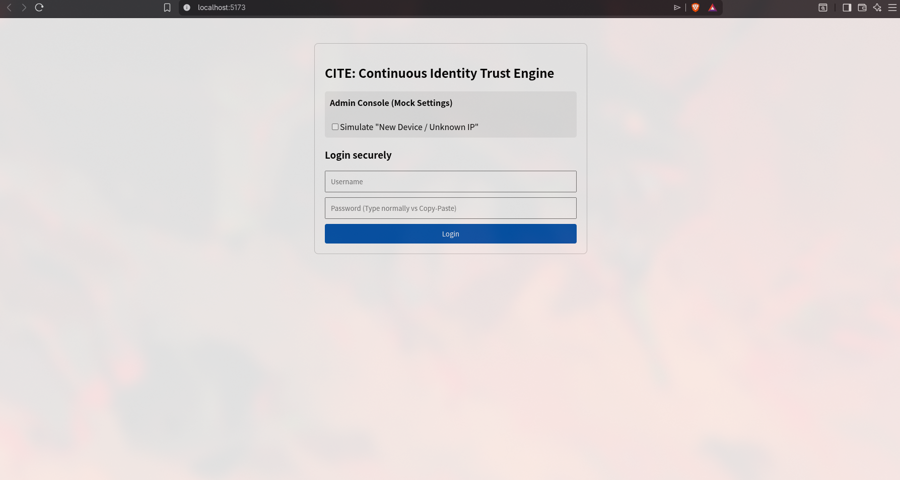
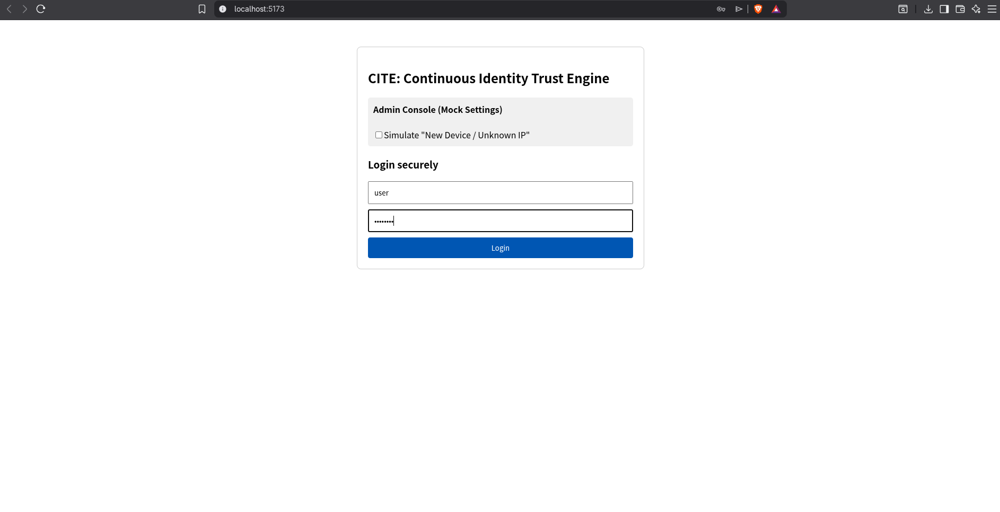
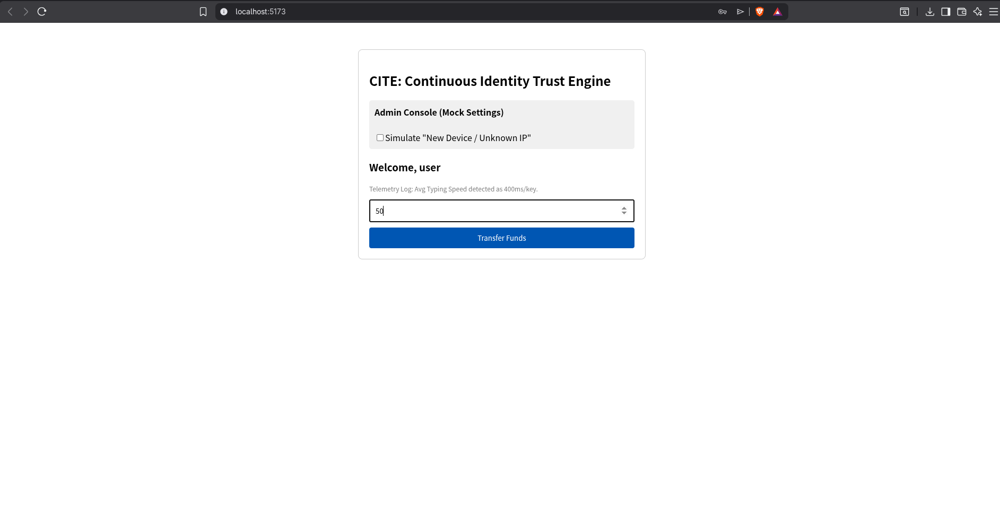
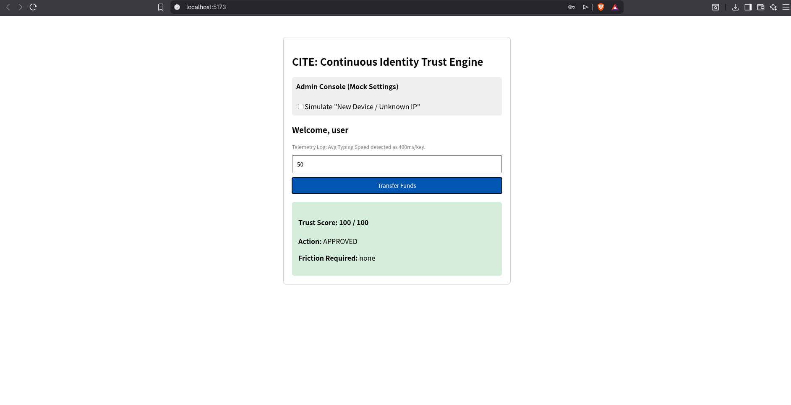
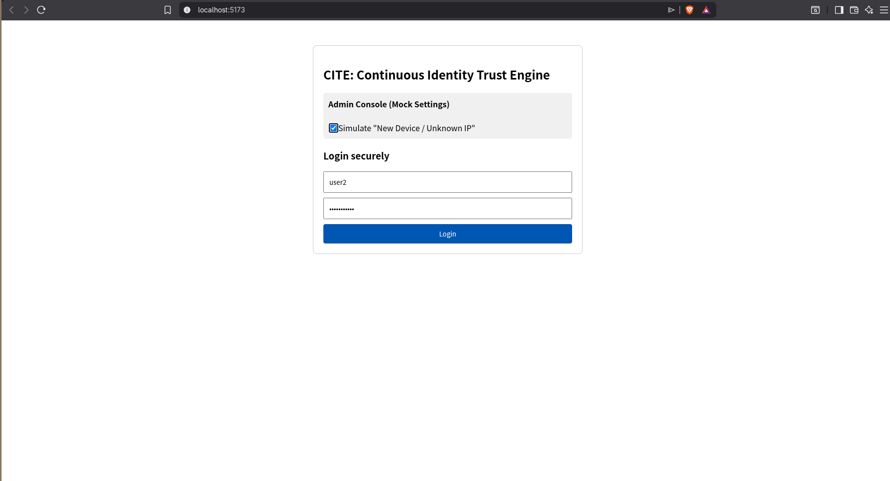
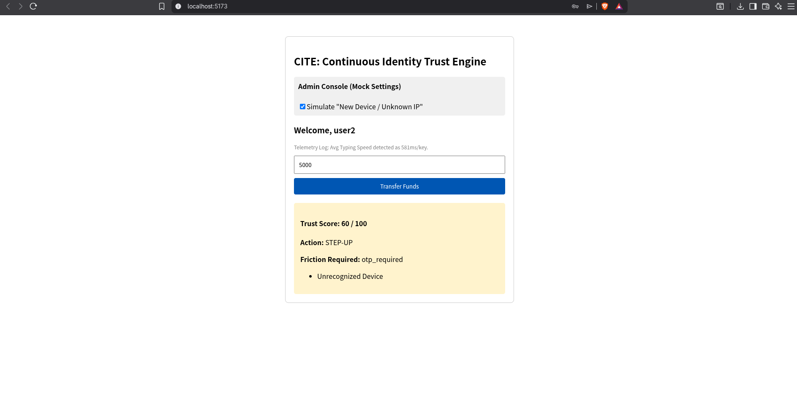
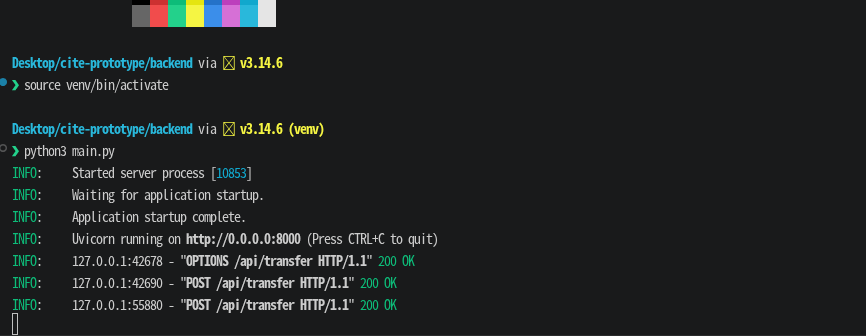

# Continuous Identity Trust Engine (CITE) - Prototype

This repository contains a lightweight, functional prototype of the **Continuous Identity Trust Engine (CITE)**. The solution is designed to address modern banking security challenges by implementing a **privacy-first, risk-based Identity Trust framework** that **continuously validates** user sessions rather than relying solely on point-in-time authentication.

## 🧠 How the Prototype Works (The Logic)

This version of the prototype operates using a **Rule-Based Risk Engine** to simulate continuous trust evaluation. 

**Note: This v1 prototype does not currently use active Machine Learning models.** Instead, it uses deterministic logic to prove the architectural flow of capturing telemetry, processing it in real-time, and dynamically altering the authentication friction.

**The Risk Scoring Logic:**
Every user starts a session with a **Trust Score of 100**. The frontend captures invisible telemetry (keystroke dynamics) and contextual data, sending it to the FastAPI backend during a transaction attempt. 
Points are deducted based on the following mock triggers:
* **Unrecognized Device Context:** `-40 points` (Simulated via UI toggle).
* **Behavioral Anomaly:** `-30 points` (Triggered if average typing speed drops below **50ms per key**, simulating a copy-paste action or bot script).
* **High-Risk Transaction:** `-20 points` (Triggered if the transfer amount exceeds **$10,000**).

**The Decision Matrix:**
* **Score > 70:** Low Risk ➔ **Approved** (Zero Friction).
* **Score 40 - 70:** Medium Risk ➔ **Step-Up Authentication** (MFA/OTP Prompted).
* **Score < 40:** High Risk ➔ **Blocked** (Account Locked).

---


## 📸 Testing & Demo Flow (Screenshot Guide)

If you are following along with the screenshots provided in the `/docs` folder, here is the step-by-step breakdown of what is happening in each phase of the demo.

### Scenario A: The Legitimate User (Zero Friction)

**Step 1:** The user visits the portal. Ensure the *Simulate "New Device"* toggle in the Admin Console is **unchecked**.


**Step 2:** The user types their username and password normally (simulating human keystroke dynamics).


**Step 3:** The user initiates a standard transfer (e.g., $50).


**Result:** The backend evaluates the telemetry. The Trust Score remains at 100. The transaction is instantly **APPROVED** without interrupting the user.


---

### Scenario B: Account Takeover / Bot Attack (Blocked)

**Step 1:** Refresh the application to reset the session. Check the *Simulate "New Device"* toggle to mimic a hacker using an unknown IP.

**Step 2:** Copy a string of text and **paste** it directly into the password field. This bypasses normal human keystroke intervals, triggering the behavioral anomaly flag.


**Step 3:** The attacker attempts to siphon funds (e.g., $5000).

**Result:** The backend detects the unrecognized device (-40) and the unnatural keystroke speed (-30). The Trust Score drops to 30. The transaction is immediately **BLOCKED**, and the account is locked.


**backend :** 




---

## 🚀 Future Roadmap: Integrating Machine Learning

While this prototype relies on hardcoded rules, the production architecture will replace these static thresholds with **dynamic Machine Learning models**. 

Implementing ML will allow the system to:
1. **Establish Individual Baselines:** Instead of a global "50ms typing speed" rule, the ML model will learn exactly how *each specific user* types, moves their mouse, and navigates.
2. **Detect Subtle Anomalies:** Algorithms like **Isolation Forests** or **Autoencoders** will analyze multidimensional telemetry data (e.g., time of day + geolocation + device type + swipe pressure) to detect fraud patterns that are invisible to rigid rule sets.
3. **Reduce False Positives:** By continuously training on user behavior, the engine will stop flagging legitimate users who simply buy a new phone or travel, adapting the Trust Score dynamically based on **historical confidence** rather than strict penalty points.

---

## 🛠️ Setup Instructions

Follow these steps to run the prototype locally. 

### Prerequisites
* **Python 3.8+** (For the FastAPI backend)
* **Node.js 18+ & npm** (For the React/Vite frontend)

### 1. Start the Backend
The backend serves the real-time risk engine API.
```bash
# Navigate to the backend directory
cd backend

# Install required Python packages
pip install fastapi uvicorn pydantic

# Run the FastAPI server
python main.py
```

The backend will now be running on http://localhost:8000.


2. Start the Frontend
The frontend tracks telemetry and provides the user interface. Open a new terminal window and run:

```bash
# Navigate to the frontend directory
cd frontend

# Install Node dependencies (including Vite and Oxlint)
npm install

# Start the development server
npm run dev
```

Click the http://localhost:5173 link in your terminal to open the CITE portal in your browser.
